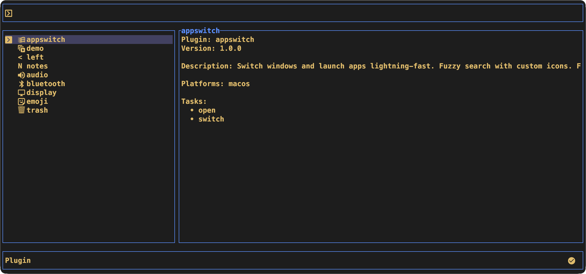
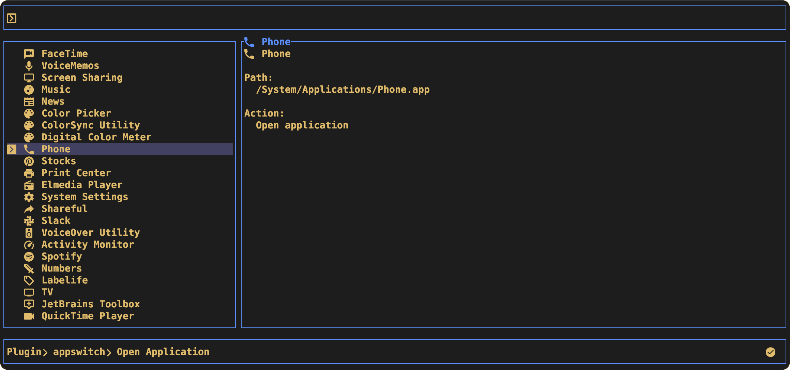
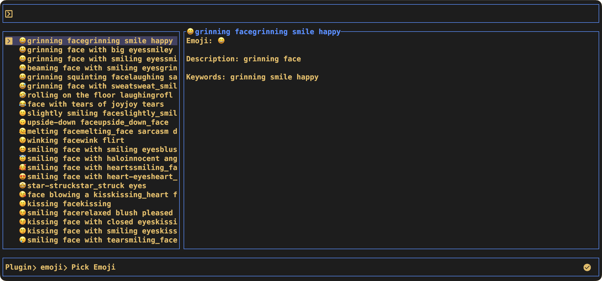

# Syntropy

[](https://github.com/marjan89/syntropy/actions)
[](https://crates.io/crates/syntropy)
[](LICENSE)

> [!WARNING]
> **Alpha Software**: Syntropy is currently in alpha stage. Features may change, and bugs may be present. Use with caution and at your own responsibility. Always review plugin code before execution, especially for tasks that modify system state.

> **Syntropy is a TUI tool with a neovim-like Lua plugin framework.** Build custom workflows for data management, maintenance tasks, and automation. Use it interactively or integrate with scripts and cron jobs. Think dmenu meets neovim, in your terminal.

**Key Features:**

- **Plugin-based architecture** - Lua plugins define tasks and actions
- **Dual-mode operation** - Interactive TUI or headless CLI execution with scripting support
- **Fuzzy search** - Quickly filter items with real-time fuzzy matching
- **Multi-select** - Select and execute multiple items in batch
- **Preview pane** - Preview items before executing actions (TUI and CLI)
- **Scriptable** - Output items, previews, and selections for integration with other tools
- **Configurable** - Keybindings, themes, and behavior via TOML config
- **XDG compliant** - Follows XDG Base Directory Specification

## Screenshots



<p align="center">
  
  
</p>

## Table of Contents

- [Quick Start](#quick-start)
  - [Installation](#installation)
  - [Initialize Plugin Environment](#initialize-plugin-environment)
  - [Discovering & Installing Plugins](#discovering--installing-plugins)
  - [Run Interactive TUI](#run-interactive-tui)
  - [Run Tasks from CLI](#run-tasks-from-cli)
- [CLI Usage](#cli-usage)
- [TUI Usage](#tui-usage)
- [Creating Plugins](#creating-plugins)
- [Configuration](#configuration)
- [Testing](#testing)
- [Contributing](#contributing)
- [License](#license)

## Quick Start

### Installation

```bash
# Build from source (requires Rust 1.70+)
cargo build --release

# Binary will be at: ./target/release/syntropy
# Optional: Move to PATH
sudo mv ./target/release/syntropy /usr/local/bin/
```

or

```bash
cargo install syntropy
```

### Initialize Plugin Environment

```bash
# Generate plugin scaffold and example config
syntropy init

# This creates:
# ~/.config/syntropy/config.toml        (configuration file)
# ~/.config/syntropy/plugins/            (user plugins directory)
# ~/.local/share/syntropy/plugins/       (managed plugins directory)
```

**Next:** See [Discovering & Installing Plugins](#discovering--installing-plugins) to browse and install community plugins.

### Discovering & Installing Plugins

**Start here:** Browse the [Available Plugins](docs/available-plugins.md) catalog to discover community plugins for common tasks like package management, backups, window switching, and more.

**Quick workflow:**
1. Browse the [Available Plugins](docs/available-plugins.md) catalog
2. Copy the plugin config snippet from the catalog
3. Add it to your `~/.config/syntropy/config.toml`
4. Run `syntropy plugins --install`

#### Plugin Types

| Type                | Location                       | Managed By                          |
| ------------------- | ------------------------------ | ----------------------------------- |
| **User plugins**    | `~/.config/syntropy/plugins/`      | Manual (you)                        |
| **Managed plugins** | `~/.local/share/syntropy/plugins/` | Plugin manager (git)                |
| **Orphan plugins**  | `~/.local/share/syntropy/plugins/` | None (leftover from removed config) |

#### Plugin Manager Commands

```bash
# List all plugins and their status
syntropy plugins --list

# Install missing plugins declared in config
syntropy plugins --install

# Remove orphaned plugins (not in config)
syntropy plugins --remove

# Upgrade all plugins to versions in config
syntropy plugins --upgrade

# Upgrade specific plugin
syntropy plugins --upgrade --plugin my-plugin
```

#### Declaring Plugins in Config

Add plugins to `config.toml`:

```toml
[plugins.packages]
git = "https://github.com/user/syntropy-plugin-packages"
tag = "v1.2.0"  # or: branch = "main", rev = "abc123"

[plugins.backups]
git = "https://github.com/user/syntropy-plugin-backups"
branch = "main"
```

Then install:

```bash
syntropy plugins --install
```

#### Plugin Discovery

Syntropy auto-discovers plugins from both directories:

1. `~/.local/share/syntropy/plugins/` (managed plugins)
2. `~/.config/syntropy/plugins/` (user plugins)

**Merge behavior:**

- If same plugin exists in both, config version **overrides** data version
- Allows customizing managed plugins without editing source

#### Plugin Validation

```bash
# Validate plugin structure
syntropy validate --plugin path/to/plugin.lua

# Common errors:
# - Missing metadata.name or metadata.version
# - Invalid semver format
# - Icon too wide (must be single char)
# - Task has neither execute nor item_sources
```

### Run Interactive TUI

```bash
# Launch the TUI
syntropy

# Navigate: arrow keys, fuzzy search, tab to select
# Execute: press enter on selected item(s)
```

### Run Tasks from CLI

```bash
# Execute task directly (for scripts/cron)
syntropy execute --plugin packages --task export

# Pass specific items to execute (comma-separated)
syntropy execute --plugin backups --task restore --items "2024-01-30"
syntropy execute --plugin packages --task info --items "git,npm,curl"

# Scripting and automation
syntropy execute --plugin packages --task list --produce-items      # List all items
syntropy execute --plugin windows --task switch --preview "Safari"  # Preview item
```

## CLI Usage

### Basic Syntax

```bash
syntropy [OPTIONS] [COMMAND]
```

### Main Options

| Flag              | Description                                 | Example                                                        |
| ----------------- | ------------------------------------------- | -------------------------------------------------------------- |
| `--config <PATH>` | Use custom config file                      | `syntropy --config ~/my-config.toml`                               |
| `--plugin <NAME>` | Select plugin to use                        | `syntropy --plugin packages`                                       |
| `--task <NAME>`   | Select task within plugin                   | `syntropy --task export`                                           |
| `execute`         | Execute task subcommand                     | `syntropy execute --plugin pkg --task list`                        |
| `--items <NAMES>` | Execute on specific items (comma-separated) | `syntropy execute --plugin pkg --task install --items "curl,wget"` |

### Execute Subcommand Flags

The `execute` subcommand supports additional flags for scripting, debugging, and integration:

| Flag                             | Description                                 | Example                          |
| -------------------------------- | ------------------------------------------- | -------------------------------- |
| `--items <NAMES>`                | Execute on specific items (comma-separated) | `--items "git,npm,curl"`         |
| `--preview <ITEM>`               | Generate preview for a single item          | `--preview "Safari"`             |
| `--produce-items`                | Output all available items (one per line)   | `--produce-items > items.txt`    |
| `--produce-preselected-items`    | Output preselected items                    | `--produce-preselected-items`    |
| `--produce-preselection-matches` | Output items that match preselection        | `--produce-preselection-matches` |

**Note:** These flags are mutually exclusive - you can only use one at a time.

### Commands

| Command                    | Description                                                      |
| -------------------------- | ---------------------------------------------------------------- |
| `init`                     | Initialize plugin development environment                        |
| `completions <SHELL>`      | Generate shell completions (zsh, bash, fish, powershell, elvish) |
| `validate --plugin <PATH>` | Validate plugin structure                                        |
| `validate --config [PATH]` | Validate config file (defaults to ~/.config/syntropy/config.toml)    |
| `plugins`                  | Manage plugins (install, remove, upgrade, list) - See [Discovering & Installing Plugins](#discovering--installing-plugins) |

### Common Usage Patterns

**Interactive TUI (default):**

```bash
# Launch with default config
syntropy

# Use custom config
syntropy --config ~/.config/syntropy/alt-config.toml

# Start at specific plugin
syntropy --plugin packages

# Start at specific task
syntropy --plugin packages --task export
```

**Direct Execution (CLI mode):**

```bash
# Execute task and exit
syntropy execute --plugin packages --task export

# Execute on specific items (comma-separated)
syntropy execute --plugin backups --task restore --items "backup-2024.tar.gz"
syntropy execute --plugin packages --task info --items "git,npm,curl"

# Use in scripts
#!/bin/bash
result=$(syntropy execute --plugin system --task disk-usage)
echo "Disk usage: $result"

# Exit code handling
syntropy execute --plugin deploy --task production
if [ $? -eq 0 ]; then
    echo "Deployment successful"
else
    echo "Deployment failed"
fi
```

**Scripting and Automation:**

```bash
# Get list of available items for processing
syntropy execute --plugin packages --task list --produce-items > packages.txt

# Preview item details before execution
syntropy execute --plugin windows --task switch --preview "Safari - Google"

# Get preselected items (useful for default selections)
syntropy execute --plugin backups --task restore --produce-preselected-items

# Find items that match preselection criteria
syntropy execute --plugin packages --task update --produce-preselection-matches

# Process items in a loop
syntropy execute --plugin files --task process --produce-items | while read item; do
    echo "Processing: $item"
    syntropy execute --plugin files --task process --items "$item"
done

# Integration with other tools
# Filter items with grep/awk before processing
syntropy execute --plugin packages --task list --produce-items \
    | grep -i "python" \
    | xargs -I {} syntropy execute --plugin packages --task info --items "{}"

# Get preview for all items
for item in $(syntropy execute --plugin docs --task view --produce-items); do
    echo "=== Preview: $item ==="
    syntropy execute --plugin docs --task view --preview "$item"
done
```

**Plugin Development:**

```bash
# Initialize scaffold
syntropy init

# Validate plugin
syntropy validate --plugin ~/.config/syntropy/plugins/my-plugin/plugin.lua

# Validate config
syntropy validate --config
```

### Shell Completions

Syntropy supports completions for **Zsh, Bash, Fish, PowerShell, and Elvish**.

#### Zsh

```bash
# Generate completion script
syntropy completions zsh > ~/.zfunc/_syntropy

# Add to ~/.zshrc (if not already present)
fpath=(~/.zfunc $fpath)

# Reload shell
source ~/.zshrc
```

**Oh My Zsh users:**

```bash
syntropy completions zsh > ~/.oh-my-zsh/completions/_syntropy
```

#### Bash

```bash
# Generate completion script
mkdir -p ~/.local/share/bash-completion/completions
syntropy completions bash > ~/.local/share/bash-completion/completions/syntropy

# Reload shell
exec bash
```

**Alternative (direct sourcing):**

```bash
# Add to ~/.bashrc
eval "$(syntropy completions bash)"
```

#### Fish

```bash
# Generate completion script
syntropy completions fish > ~/.config/fish/completions/syntropy.fish

# Reload shell
exec fish
```

#### PowerShell

```powershell
# Generate and load completion
syntropy completions powershell | Out-String | Invoke-Expression

# To persist, add to profile:
syntropy completions powershell >> $PROFILE
```

#### Elvish

```bash
# Generate completion script
syntropy completions elvish > ~/.config/elvish/lib/syntropy.elv

# Add to rc.elv:
# use syntropy
```

### Environment Variables

| Variable          | Purpose                   | Example                          |
| ----------------- | ------------------------- | -------------------------------- |
| `XDG_CONFIG_HOME` | Override config directory | `XDG_CONFIG_HOME=/tmp/test syntropy` |
| `XDG_DATA_HOME`   | Override data directory   | `XDG_DATA_HOME=/tmp/data syntropy`   |

**Testing with temp directories:**

```bash
XDG_CONFIG_HOME=/tmp/test XDG_DATA_HOME=/tmp/data syntropy
```

## TUI Usage

### Default Keybindings

| Action         | Key                  | Description                                         |
| -------------- | -------------------- | --------------------------------------------------- |
| **Navigation** |
| Previous item  | `↑`                  | Move selection up                                   |
| Next item      | `↓`                  | Move selection down                                 |
| Confirm        | `Enter`              | Execute selected item(s) or navigate into selection |
| Back           | `Esc`                | Go back to previous screen                          |
| Quit           | `Ctrl-c`             | Exit syntropy (hardcoded, not customizable)             |
| **Selection**  |
| Toggle select  | `Tab`                | Toggle item selection (multi-mode only)             |
| **Preview**    |
| Scroll up      | `Ctrl-↑`             | Scroll preview pane up                              |
| Scroll down    | `Ctrl-↓`             | Scroll preview pane down                            |
| Toggle preview | `Ctrl-p`             | Show/hide preview pane                              |
| **Search**     |
| Type to search | Any char             | Filter items with fuzzy search                      |
| Clear search   | `Backspace`          | Delete characters from search                       |
| Move cursor    | `←` `→` `Home` `End` | Edit search query                                   |

**Note:** All keybindings are customizable in `config.toml`. See [Configuration](#configuration).

### Navigation Flow

```
Plugin List → Task List → Item List → Execute
     ↓           ↓            ↓
   [icon] name  task name   [tag] item
```

**Workflow:**

1. **Select Plugin** - Choose from available plugins
2. **Select Task** - Choose task within plugin
3. **Select Items** - Choose item(s) to execute (fuzzy search available)
4. **Execute** - Press Enter to run action

**Navigation:**

- `Enter` - Move forward (select plugin → task → execute)
- `Esc` - Move backward (return to previous screen)

### Fuzzy Search

The search bar appears at the bottom when enabled (`search_bar = true` in config).

**How it works:**

- Type to filter items in real-time
- Matching is **fuzzy** - "pkg" matches "packages", "package-lock", etc.
- Case-insensitive
- Clear with Backspace

**Example:**

```
Items: [homebrew, cargo, pip, npm, yarn, pipx]
Search: "crg" → Matches: [cargo]
Search: "pp" → Matches: [pip, npm]
```

### Multi-Select Mode

Tasks with `mode = "multi"` allow selecting multiple items.

**Workflow:**

1. Navigate to items with `↑` `↓`
2. Press `Tab` to toggle selection (checkmark appears)
3. Select multiple items
4. Press `Enter` to execute all selected items

**Visual indicator:**

```
[x] item1    (selected)
[ ] item2    (not selected)
[x] item3    (selected)
```

### Preview Pane

Shows additional information about the selected item.

**Controls:**

- `Ctrl-↑` - Scroll preview up
- `Ctrl-↓` - Scroll preview down
- `Ctrl-p` - Toggle preview visibility

**When preview appears:**

- Plugin defines `preview(item)` function
- Task or item source provides preview
- Preview pane enabled in config (`show_preview_pane = true`)

**CLI access:** Use `syntropy execute --preview <ITEM>` to get preview output from the command line (useful for scripting)

### Status Bar

Shows current navigation context (breadcrumb) and keybinding hints.

**Example:**

```
packages > export_packages | ↑↓:Navigate  Enter:Select  Esc:Back  Tab:Toggle
```

Toggle with `status_bar = true/false` in config.

## Creating Plugins

### Quick Example

Create a plugin in 30 seconds:

```bash
# 1. Create plugin directory
mkdir -p ~/.config/syntropy/plugins/hello

# 2. Create plugin.lua
cat > ~/.config/syntropy/plugins/hello/plugin.lua << 'EOF'
---@type PluginDefinition
return {
    metadata = {
        name = "hello",
        version = "1.0.0",
        icon = "H",
    },
    tasks = {
        greet = {
            name = "Say Hello",
            item_sources = {
                names = {
                    tag = "n",
                    items = function()
                        return {"Alice", "Bob", "Charlie"}
                    end,
                    execute = function(items)
                        for _, name in ipairs(items) do
                            print("Hello, " .. name .. "!")
                        end
                        return "Greeted " .. #items .. " people", 0
                    end,
                },
            },
        },
    },
}
EOF

# 3. Run syntropy (plugin auto-discovered)
syntropy
```

**Want to use existing plugins first?** Check out [Discovering & Installing Plugins](#discovering--installing-plugins) to browse community plugins before building your own.

**Note:** This example keeps all code in `plugin.lua` for simplicity. For complex plugins with multiple modules, use the `lua/pluginname/` directory structure with namespaced imports. See the "Organizing plugin code with modules" section in [Common Patterns](#common-patterns).

### Plugin Structure

Every plugin is a Lua script returning a table:

```lua
---@type PluginDefinition
return {
    metadata = {
        name = "plugin-name",    -- Required: unique identifier
        version = "1.0.0",       -- Required: semver
        icon = "P",              -- Optional: single char (Unicode/Nerd Font OK, no emojis)
        description = "...",     -- Optional
        platforms = {"macos"},   -- Optional: filter by OS
    },
    tasks = {
        task_key = {
            name = "Task Display Name",
            mode = "multi",  -- "multi" | "none"
            suppress_success_notification = false,  -- Optional: suppress success modal (default: false)

            item_sources = {
                source_key = {
                    tag = "s",  -- Short tag for UI
                    items = function()
                        return {"item1", "item2"}
                    end,
                    execute = function(items)
                        -- Do something with items
                        return "Done", 0  -- (output, exit_code)
                    end,
                },
            },
        },
    },
}
```

**Plugin Directory Structure:**

For plugins with multiple modules:

```
my-plugin/
├── plugin.lua           # Main plugin definition
└── lua/
    └── my-plugin/       # Namespace matches plugin name
        ├── module1.lua  # require("my-plugin.module1")
        ├── module2.lua  # require("my-plugin.module2")
        └── subdir/
            └── init.lua # require("my-plugin.subdir")
```

Modules must use namespaced imports: `require("my-plugin.module1")`

### Available Lua APIs

Plugins have access to:

**syntropy namespace:**

```lua
-- Execute shell command
local output, exit_code = syntropy.shell("ls -la")

-- Launch external TUI applications with full terminal control
local exit_code = syntropy.invoke_tui("fzf", {"--multi", "--preview", "cat {}"})
local exit_code = syntropy.invoke_editor("/path/to/file.txt")

-- Expand paths (tilde, environment variables, plugin-relative paths)
local path = syntropy.expand_path("~/Documents")
```

**Module loading:**

- `require("pluginname.module")` - Load plugin-namespaced modules from `lua/pluginname/module.lua`
- `require("module")` - Load shared modules from `plugins/shared/module.lua`
- Modules are cached after first load (standard Lua behavior)

**Standard Lua library:**

- All standard modules (string, table, math, io, os)
- Except: `os.exit()`, `os.execute()` (use `syntropy.shell()`)

### Common Patterns

**Reading files:**

```lua
items = function()
    local file = io.open(syntropy.expand_path("~/.config/bookmarks"), "r")
    if not file then return {} end
    local lines = {}
    for line in file:lines() do
        table.insert(lines, line)
    end
    file:close()
    return lines
end
```

**Calling shell commands:**

```lua
execute = function(items)
    for _, item in ipairs(items) do
        local output, code = syntropy.shell("process " .. item)
        if code ~= 0 then
            return "Failed: " .. output, code
        end
    end
    return "Success", 0
end
```

**Previewing items:**

```lua
preview = function(item)
    local output, _ = syntropy.shell("stat " .. item)
    return output
end
```

**Launching external TUI applications:**

```lua
-- Open files in user's editor
execute = function(items)
    if #items == 0 then return "No items selected", 1 end

    local code = syntropy.invoke_editor(items[1])
    if code == 0 then
        return "File edited successfully", 0
    else
        return "Editor exited with code " .. code, code
    end
end

-- Launch any TUI app (fzf, htop, ranger, etc.)
execute = function()
    local code = syntropy.invoke_tui("htop", {})
    return "Process monitor closed", code
end

-- Tip: Suppress success notifications for cleaner workflows
tasks = {
    edit = {
        description = "Edit files",
        suppress_success_notification = true,  -- No modal after editor closes
        execute = function(items)
            local code = syntropy.invoke_editor(items[1])
            return "File edited", code
        end,
    },
}
```

**Organizing plugin code with modules:**

For complex plugins with multiple files, use the Neovim-style `lua/` directory structure:

```lua
-- Create module: ~/.config/syntropy/plugins/my-plugin/lua/my-plugin/utils.lua
local utils = {}
function utils.validate(item)
    return string.len(item) > 0
end
return utils

-- Use in plugin.lua with namespaced import:
local utils = require("my-plugin.utils")

execute = function(items)
    for _, item in ipairs(items) do
        if not utils.validate(item) then
            return "Invalid item: " .. item, 1
        end
    end
    return "All valid", 0
end
```

**Key points:**

- Plugin modules MUST use namespaced imports: `require("pluginname.module")`
- Directory structure: `lua/pluginname/module.lua`
- Supports `lua/pluginname/module/init.lua` for directory-style modules
- Shared modules (in `plugins/shared/`) use flat imports: `require("module")`

See [Plugin Development Guide](docs/plugins.md) for full module organization details.

### Next Steps

- **Browse plugins:** [Available Plugins](docs/available-plugins.md) - See community plugins for inspiration
- **Full tutorial:** [Plugin Development Guide](docs/plugins.md)
- **API reference:** [Plugin API Reference](docs/plugin-api-reference.md)
- **Contributing:** [Contributor Guide](./CONTRIBUTING.md)

## Configuration

Config location: `~/.config/syntropy/config.toml`

For complete reference of all 88 config options, see [Configuration Reference](docs/config-reference.md).

### Example Config

```toml
# Default plugin to show on startup
default_plugin = "packages"

# Default task within plugin
default_task = "list"

# Default icon for plugins without icon
default_plugin_icon = "⚒"

# UI options
status_bar = true
search_bar = true
show_preview_pane = true
exit_on_execute = false

# Custom keybindings
[keybindings]
back = "<esc>"
select_previous = "<up>"
select_next = "<down>"
scroll_preview_up = "["
scroll_preview_down = "]"
toggle_preview = "<C-p>"
select = "<tab>"
confirm = "<enter>"

# Managed plugins (installed via plugin manager)
[plugins.packages]
git = "https://github.com/user/syntropy-plugin-packages"
tag = "v1.0.0"

# Styling (optional)
[styles.screen_scaffold]
left_split = 50
right_split = 50

[styles.status]
left_split = 70
right_split = 30

[styles.modal]
vertical_size = 80
horizontal_size = 60
```

### Key Binding Format

| Format   | Example                                       | Description      |
| -------- | --------------------------------------------- | ---------------- |
| `<char>` | `<a>`, `<b>`                                  | Single character |
| `<key>`  | `<up>`, `<down>`, `<enter>`, `<esc>`, `<tab>` | Special keys     |
| `<C-x>`  | `<C-p>`, `<C-n>`                              | Ctrl + key       |
| `<S-x>`  | `<S-tab>`                                     | Shift + key      |
| `<A-x>`  | `<A-q>`                                       | Alt + key        |

## Testing

Syntropy includes comprehensive unit and integration tests.

### Running Tests

```bash
# Run all tests
cargo test

# Run only unit tests (fast)
cargo test --lib

# Run only integration tests
cargo test --test '*'

# Run specific test
cargo test test_plugin_loading

# Show output (println! statements)
cargo test -- --nocapture

# Run tests serially (not parallel)
cargo test -- --test-threads=1
```

### Test Coverage

- **Unit tests** - Parsing, validation, keybindings, navigation
- **Integration tests** - Plugin loading, merging, CLI execution, config validation

## Contributing

Contributions welcome! Please read the [Contributor Guide](./CONTRIBUTING.md) for:

- Architecture overview with ASCII diagram
- Codebase navigation guide
- Testing philosophy (TDD approach)
- Code patterns and conventions
- Pull request process

**Quick start for contributors:**

```bash
# Clone and build
git clone https://github.com/marjan89/syntropy
cd syntropy
cargo build

# Run tests
cargo test

# Check linting
cargo clippy

# Format code
cargo fmt
```

## License

[MIT License](LICENSE)

---

**Documentation:**

- **[Available Plugins](docs/available-plugins.md)** - Curated list of community plugins (start here!)
- [Plugin Development Guide](docs/plugins.md) - Concepts and tutorial
- [Plugin API Reference](docs/plugin-api-reference.md) - Complete API documentation
- [Configuration Reference](docs/config-reference.md) - Complete config.toml reference
- [Recipes](docs/recipes.md) - Integration examples and workflows
- [Contributor Guide](./CONTRIBUTING.md) - Architecture and development guide
